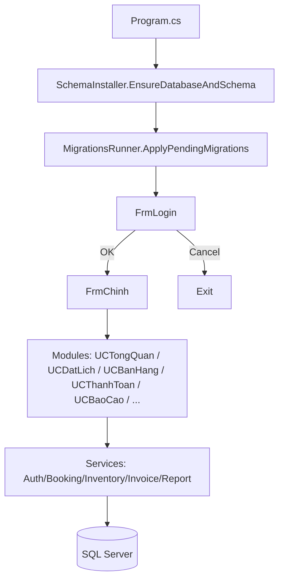

# DemoPick

Ứng dụng WinForms (.NET Framework 4.8) phục vụ quản lý sân pickleball theo luồng **Đặt lịch → Bán hàng/Thanh toán → Báo cáo**, kèm cơ chế **tự khởi tạo CSDL + apply migrations** khi chạy.

---

## Nội dung

- [DemoPick là gì?](#demopick-là-gì)
- [Tính năng chính](#tính-năng-chính)
- [Kiến trúc nhanh](#kiến-trúc-nhanh)
- [Chạy nhanh (Dev)](#chạy-nhanh-dev)
- [Database workflow (script-first)](#database-workflow-script-first)
- [Cấu trúc thư mục](#cấu-trúc-thư-mục)
- [Tài liệu trong repo](#tài-liệu-trong-repo)
- [Smoke test](#smoke-test)
- [Ghi chú bảo mật](#ghi-chú-bảo-mật)

---

## DemoPick là gì?

DemoPick tập trung vào các nghiệp vụ thường gặp tại sân pickleball:

- **Đặt lịch** theo sân/khung giờ, tránh trùng lịch.
- **Đặt cố định / Bảo trì (Maintenance)** để block lịch, *không* đi vào doanh thu/occupancy.
- **POS/Bán hàng**: thêm sản phẩm vào giỏ theo sân/booking.
- **Thanh toán**: tạo hóa đơn gồm **tiền sân** + **sản phẩm**, cập nhật tồn kho (nếu bật trigger/logic trừ kho).
- **Báo cáo/Dashboard**: tổng quan KPI, top sân, xu hướng.

---

## Tính năng chính

| Nhóm | Mô tả | UI/Thành phần tiêu biểu |
|---|---|---|
| Xác thực | Đăng nhập, đăng ký, đổi mật khẩu | `FrmLogin`, `FrmRegister`, `FrmDoiMatKhau`, `AuthService` |
| Đặt lịch | Tạo booking, hiển thị lịch theo ngày | `UCDatLich`, `FrmDatSan`, `BookingController` |
| Cố định/Bảo trì | Tạo block lặp (recurring), dùng cho cố định hoặc bảo trì | `FrmDatSanCoDinh` |
| POS/Bán hàng | Chọn sản phẩm, giảm giá, tạo giỏ | `UCBanHang`, `PosService`, `InventoryService` |
| Thanh toán | Checkout tiền sân + sản phẩm, sinh invoice | `UCThanhToan`, `InvoiceService` |
| Báo cáo | Lọc theo thời gian, xem KPI/Top | `UCBaoCao`, `ReportService`, `Reports/Bill.rdlc` |

---

## Kiến trúc nhanh



**Điểm nhấn**
- Database được dựng theo kiểu **script-first**: schema + seed + migrations nằm trong thư mục `Database/`.
- App khởi động sẽ cố gắng đảm bảo DB tồn tại, chạy schema, rồi apply migrations trước khi vào UI.

---

## Chạy nhanh (Dev)

### 1) Yêu cầu môi trường

- Windows
- Visual Studio (hoặc MSBuild) hỗ trợ .NET Framework
- .NET Framework 4.8
- SQL Server / SQL Server Express

### 2) Cấu hình kết nối DB

Sửa connection string `DefaultConnection` trong [App.config](App.config).

Ví dụ (SQL Express + Windows Auth):
```xml
<add name="DefaultConnection" connectionString="Server=.\SQLEXPRESS;Database=PickleProDB;Integrated Security=True;" providerName="System.Data.SqlClient" />
```

### 3) Restore packages & Build

Repo dùng `packages.config` và restore theo cấu hình ở [NuGet.Config](NuGet.Config) (mặc định restore ra thư mục `..\packages`).

Gợi ý:
- Nếu bạn dùng VS Code, có thể chạy task build (kèm restore) theo cấu hình `tasks.json` của workspace.
- Nếu build bằng CLI, có thể chạy `nuget restore` rồi build `.sln`.

### 4) Run

Chạy app sẽ tự:
1) Tạo DB (nếu chưa có)
2) Chạy schema script (embedded resource)
3) Apply migrations
4) Mở màn hình đăng nhập

**DEBUG-only bootstrap Admin**
- Ở build DEBUG, app có thể seed 1 tài khoản `admin` nếu bảng `StaffAccounts` đang rỗng.
- Mật khẩu bootstrap sẽ lấy từ env var `DEMOPICK_BOOTSTRAP_ADMIN_PASSWORD` hoặc tự sinh ngẫu nhiên và hiển thị 1 lần.

---

## Database workflow (script-first)

Tài liệu chi tiết: [Docs/DB-WORKFLOW.md](Docs/DB-WORKFLOW.md)

### Schema script
- File chính: [Database/PickleProDB_Complete.sql](Database/PickleProDB_Complete.sql)
- Được chạy từ embedded resources khi app khởi động (giảm rủi ro bị sửa `.sql` cạnh file chạy).

### Migrations
- Thư mục: [Database/Migrations](Database/Migrations)
- Quy ước tên: `NNNN__Description.sql`
- App lưu checksum để chống “drift” (sửa migration đã apply sẽ bị báo lỗi).

### Seed dữ liệu test
- File: [Database/TesterData_Seed.sql](Database/TesterData_Seed.sql)
- Chỉ nên chạy trong môi trường dev/test. File này dùng dữ liệu placeholder để phục vụ test màn hình/biểu đồ.

---

## Cấu trúc thư mục

```text
DemoPick/
  Controllers/        # Controller-level orchestration (vd: booking)
  Database/           # Schema + seed + migrations
  Docs/               # Tài liệu kỹ thuật / checklist / smoke test
  Models/             # Model/DTO
  Reports/            # RDLC (ReportViewer)
  Resources/          # Assets
  Services/           # Data access + business logic
  Tools/              # Script/tiện ích nội bộ
  Views/              # WinForms + UserControl
  App.config          # Connection string & runtime config
  DemoPick.sln        # Solution
  DemoPick.csproj     # Project (.NET Framework 4.8)
```

---

## Tài liệu trong repo

- Click/event wiring map: [Docs/README.md](Docs/README.md)
- Checklist chống double-wiring: [Docs/CLICK-WIRING-CHECKLIST.md](Docs/CLICK-WIRING-CHECKLIST.md)
- Database workflow: [Docs/DB-WORKFLOW.md](Docs/DB-WORKFLOW.md)

---

## Smoke test

- Test Maintenance booking không ảnh hưởng doanh thu/occupancy + không đi vào checkout: [Docs/SMOKE_TEST.md](Docs/SMOKE_TEST.md)

---

## Ghi chú bảo mật

- Báo cáo audit (Zero Trust): [Docs/SECURITY-AUDIT.md](Docs/SECURITY-AUDIT.md)

Lưu ý: một số nội dung trong audit là theo trạng thái tại thời điểm viết; nếu bạn vừa thay đổi logic seed admin/lockout, hãy rà lại để đồng bộ tài liệu.
